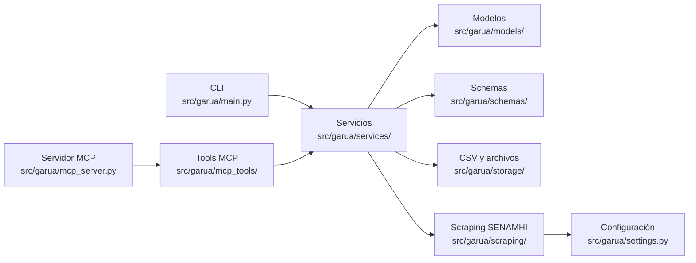

# Arquitectura

Garúa está organizado como un paquete Python con tres superficies principales:
CLI, servidor MCP y servicios internos reutilizables. La regla central del
proyecto es mantener la lógica de dominio fuera de las interfaces.



## Capas

| Capa | Ruta | Responsabilidad |
| --- | --- | --- |
| Entradas | `src/garua/main.py`, `src/garua/__main__.py` | Expone la CLI interactiva y la ejecución con `python -m garua`. |
| Servidor MCP | `src/garua/mcp_server.py` | Crea el servidor FastMCP y registra los grupos de tools. |
| Tools MCP | `src/garua/mcp_tools/` | Adaptan parámetros MCP, docstrings y respuestas para clientes compatibles. |
| Servicios | `src/garua/services/` | Contienen reglas de negocio, búsqueda, descargas, resúmenes, comparación y validación. |
| Métricas | `src/garua/services/metrics/` | Centralizan cálculos reutilizables para datos meteorológicos e hidrológicos. |
| Modelos | `src/garua/models/` | Representan entidades internas y estructuras de dominio. |
| Schemas | `src/garua/schemas/` | Definen contratos de respuesta y serialización. |
| Scraping | `src/garua/scraping/` | Maneja navegador, modos de consulta y extracción desde SENAMHI. |
| Storage | `src/garua/storage/` | Gestiona rutas y archivos CSV locales. |
| Configuración | `src/garua/settings.py` | Centraliza rutas, URLs, timeouts y variables de entorno. |

## Regla de diseño

Las interfaces deben ser delgadas:

- La CLI debe pedir datos, llamar servicios y presentar resultados.
- Las tools MCP deben describir intención, validar parámetros básicos y delegar.
- Los servicios deben concentrar cálculos, reglas, parsing y decisiones de flujo.
- El scraping debe limitarse a obtener datos; no debe decidir métricas de análisis.

Cuando una regla pueda usarse desde CLI y MCP, debe vivir en `services/` o en una
utilidad compartida. Evita duplicar cálculos dentro de una tool MCP.

## Flujo de datos

1. El usuario busca o confirma una estación.
2. Garúa obtiene metadatos desde el catálogo local de estaciones.
3. Si se requiere descarga, el scraper consulta SENAMHI con un navegador local.
4. Los CSV se guardan en la carpeta de salida configurada.
5. Los servicios leen CSV locales para resumir, comparar o validar calidad.
6. La CLI o el servidor MCP devuelven una respuesta orientada al usuario.

## Documentación generada

La referencia de tools MCP no se edita manualmente. Se genera desde firmas,
docstrings y metadatos de `src/garua/mcp_tools/*.py`:

```bash
python scripts/generate_tools_reference.py
```

Después de cambiar tools o docstrings, regenera
`docs/reference/tools.md` y valida la documentación con:

```bash
zensical build --clean --strict
```

## Lecturas relacionadas

- [Servidor MCP](mcp-server.md){data-preview}
- [Contribuir](contributing.md){data-preview}
- [Referencia de tools MCP](../reference/tools.md){data-preview}
