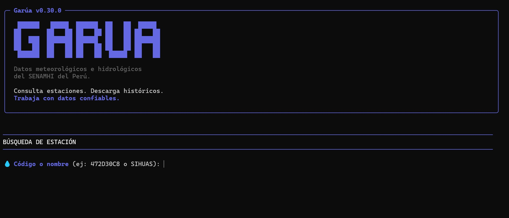

# Uso CLI

La CLI sirve para buscar estaciones y descargar datos desde una terminal. Puedes usarla como app interactiva con menu o como comando directo con parámetros.

## App interactiva

Ejecuta Garua sin argumentos:

```bash
garua
```

Esto abre una interfaz en terminal que te guía paso a paso para:

- Buscar o seleccionar una estación.
- Elegir modo de descarga: mes, año o período.
- Definir fechas.
- Generar archivos CSV.



Usa este modo cuando estas explorando o prefieres que Garua te pregunte los datos necesarios.

## Comandos con parámetros

Usa parámetros cuando ya sabes que estación y período necesitas, o cuando quieres automatizar una descarga.

## Ver ayuda

```bash
garua --help
```

## Ver versión

```bash
garua --version
```

## Buscar estaciones

```bash
garua --search Cabana
garua --search 108047
```

Usa la búsqueda antes de descargar si no conoces el código interno de la estación.

## Descargar un mes

La descarga abre un navegador local para consultar SENAMHI y superar Cloudflare Turnstile cuando aparece.

```bash
garua --station 108047 --mode month --year 2025 --month 7
```

## Descargar un año completo

```bash
garua --station 108047 --mode year --year 2025
```

Para generar un CSV por mes:

```bash
garua --station 108047 --mode year --year 2025 --individual
```

## Descargar un período

```bash
garua --station 108047 --mode period --start 2020 --end 2025
```

## Salida

Garua guarda los CSV en la carpeta de salida configurada. Los nombres incluyen estación y período, por ejemplo:

```text
Cabana-202507.csv
Cabana-2025.csv
Cabana-2020-2025.csv
```

Ver mas detalles en [../reference/output-files.md](../reference/output-files.md).
