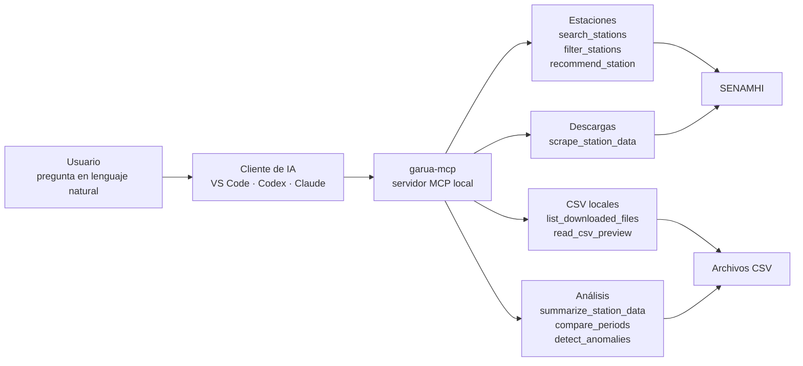

# ¿Qué es MCP en Garúa?

MCP, o **Model Context Protocol**, es una forma estándar para que un cliente de IA use herramientas externas. En Garúa, eso significa que VS Code, Codex, Claude u otro cliente compatible pueden comunicarse con `garua-mcp` y pedirle acciones concretas al proyecto.

La idea importante es sencilla: el asistente no solo responde con texto. También puede llamar herramientas reales para buscar estaciones, descargar datos, leer CSV, resumir periodos, comparar información o validar calidad.

## Flujo general

## Explicación corta

Cuando escribes una solicitud en un cliente de IA, el cliente decide si necesita usar una herramienta. Si la tarea está relacionada con datos SENAMHI, puede llamar al servidor local `garua-mcp`.

`garua-mcp` expone las herramientas de Garúa. Por ejemplo, puede buscar estaciones con `search_stations`, descargar datos con `scrape_station_data`, revisar archivos locales con `read_csv_preview` o analizar información con `summarize_station_data_tool`, `compare_periods_tool` y `detect_anomalies_tool`.

El resultado vuelve al cliente de IA, que lo transforma en una respuesta más clara para ti.

## Qué corre en tu máquina

`garua-mcp` se ejecuta localmente. El cliente MCP se comunica con ese proceso por `stdio`, y Garúa usa tus archivos locales y la configuración de tu entorno.

!!! info "Descargas desde SENAMHI"
    Cuando una herramienta necesita descargar datos desde SENAMHI, Garúa puede abrir un navegador local basado en Chromium. Esto permite consultar el portal y completar la verificación Cloudflare Turnstile cuando aparezca.

## Siguiente paso

- Para configurar el servidor, revisa [Instalación](../installation.md#configurar-mcp){data-preview}.
- Para ver prompts y uso práctico, revisa [Uso MCP Server](mcp.md){data-preview}.
- Para conocer todas las herramientas disponibles, revisa [Referencia de tools MCP](../reference/tools.md){data-preview}.
