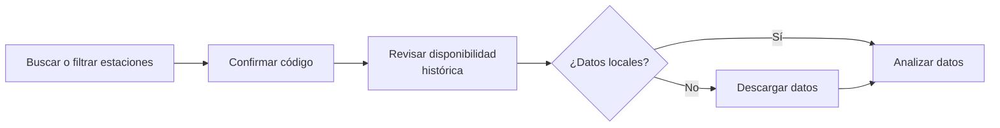

# Uso MCP Server

El servidor MCP permite usar Garúa desde clientes compatibles con [Model Context Protocol]. Es ideal cuando quieres pedir tareas en lenguaje natural y dejar que el cliente de IA llame las tools correctas.

[Model Context Protocol]: https://modelcontextprotocol.io/docs/getting-started/intro

## Ejecutar servidor

```bash
garua-mcp
```

## Configuración básica

```json
{
  "mcpServers": {
    "garua": {
      "command": "garua-mcp"
    }
  }
}
```

Si el cliente no encuentra el comando, usa la ruta absoluta al ejecutable o al Python del entorno virtual. Puedes revisar [Instalar y Configurar](../installation.md#instalar-desde-pypi){data-preview}


!!! info "Nota sobre descargas"
    Cuando pidas descargar datos, Garúa abrirá un navegador local para scrapear el sitio de SENAMHI y superar la verificación Cloudflare Turnstile cuando aparezca. Esto es esperado en la tool de descarga.


## Prompts útiles

```text
- Busca estaciones meteorologicas en Arequipa sobre 3000 msnm
- Qué estaciones hay cerca de lat -7.61, lon -77.82?
- Descarga datos de julio 2025 de la estacion Cabana
- Resume julio 2025 para la estacion 108047
- Compara marzo 2025 vs marzo 2026 para Cabana
- Valida la calidad de datos de julio 2025 para la estacion 108047
```

## Flujo



!!! example ""
    El **análisis** puede ser un resumen, una comparación entre periodos o una validación de calidad, según tu objetivo.


## Referencia técnica

La lista completa de tools esta en [Referencia de tools MCP](../reference/tools.md){data-preview}. Esa referencia se genera desde los docstrings del código para mantenerla sincronizada con el servidor.
